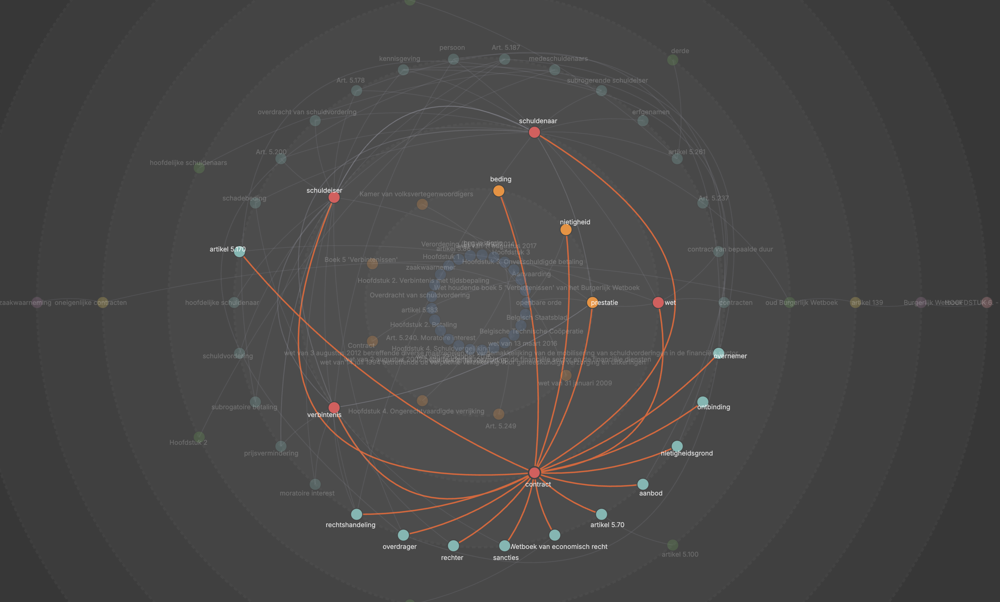
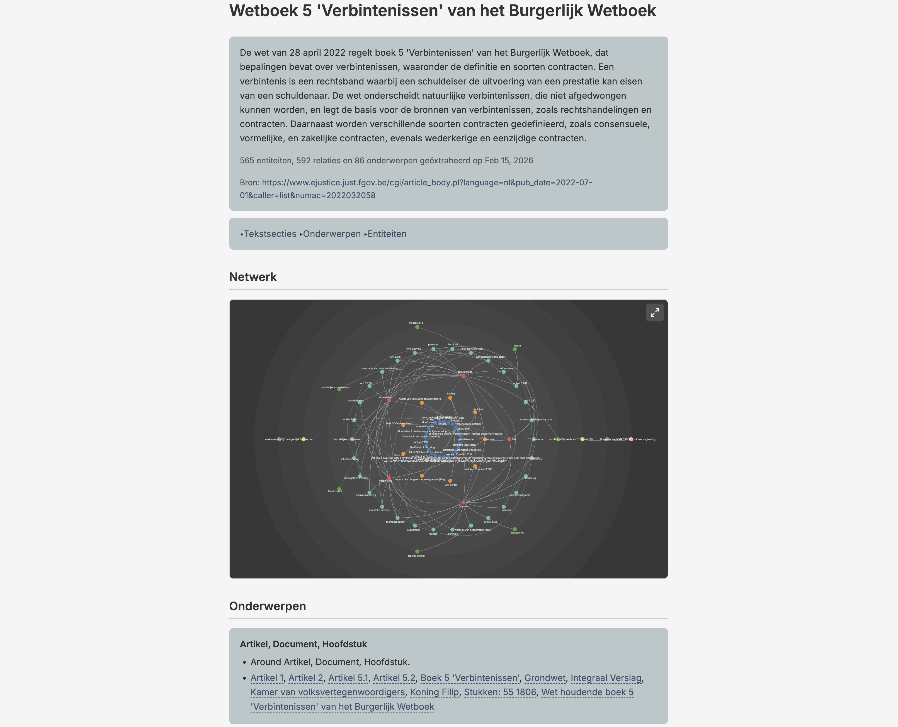

# Knwler

[](https://pypi.org/project/knwler/)
[](https://github.com/Orbifold/knwler)
[](./LICENSE)

[](https://github.com/Orbifold/knwler)

**Turn documents into structured knowledge.**

Knwler is a lightweight Python tool that extracts structured knowledge graphs from documents using AI. Feed it a PDF, URL, or text file and receive a richly connected network of entities, relationships, and topics — complete with an interactive HTML report and exports ready for your favorite graph analytics platform.

Built for compliance teams, legal departments, research analysts, and anyone who needs to rapidly understand the structure hidden inside dense documents.

No big package dependencies, runs local if you wish, no licenses, no fuss.





---

## Table of Contents

- [Why Knwler?](#why-knwler)
- [What's New in v1.0](#whats-new-in-v1)
- [Key Features](#key-features)
- [Supported Backends](#supported-backends)
- [Cost & Performance](#cost--performance)
- [Quick Start](#quick-start)
- [CLI Overview](#cli-overview)
- [Examples](#examples)
- [Integration & Export](#integration--export)
- [Documentation](#documentation)
- [Benchmarking](#benchmarking)
- [Disclaimer](#disclaimer)

---

## Why Knwler?

| Challenge                                                                     | How Knwler Solves It                                                                                                                                 |
| ----------------------------------------------------------------------------- | ---------------------------------------------------------------------------------------------------------------------------------------------------- |
| Manually mapping entities and relationships in 100+ page regulatory documents | Automated extraction produces a navigable knowledge graph in minutes                                                                                 |
| Expensive vendor lock-in for document intelligence                            | Runs fully local with Ollama or LM Studio (zero data leaves your machine) or via cloud providers for speed                                           |
| Documents in multiple languages across jurisdictions                          | Auto-detects language and adapts all prompts — supports English, German, French, Spanish, Dutch, Italian, Portuguese, and Chinese                    |
| Results trapped inside one tool                                               | Exports to HTML, GML, GraphML, JSONLD/RDF, and raw JSON — import directly into Neo4j, Gephi, yEd, SurrealDB, GraphDB, Neptune, or any graph platform |
| High per-document processing costs                                            | ~$0.20 per 20-page PDF with OpenAI; completely free when running locally; LLM response caching means re-runs cost nothing                            |
| Processing many documents at scale                                            | Batch processing for OpenAI and Gemini with SQLite-based resume support, plus directory ingestion                                                    |
| Understanding what matters most in the graph                                  | Built-in graph analytics and reporting — find the most important entities, chunks, and clusters                                                      |

Knwler does not implement graph RAG — it focuses on one thing: turning unstructured text into a knowledge graph. You decide how to embed, which graph database to use, and what agentic framework to layer on top.

---

## What's New in v1.0.0

This is a major release with many new features and improvements. See the full [CHANGELOG](./CHANGELOG.md) for details.

Highlights:

- **Google Gemini** added as an LLM backend (including batch processing)
- **Anthropic** added as an LLM backend (Claude Sonnet/Haiku)
- **LM Studio** support for local inference
- **Directory ingestion** — process a whole directory of files with `--directory`
- **Multi-document consolidation** — merge knowledge graphs from multiple extractions into one
- **Batch processing** for OpenAI and Gemini with SQLite-based resume
- **Graph analytics** CLI commands — convert graphs to GML/GraphML/JSONLD and generate analytical reports
- **JSONLD/RDF export** for triple stores (GraphDB, StarDog, etc.)
- **AWS Neptune** import script
- **Fetch command** — give a URL (PDF or webpage) or a Wikipedia topic and Knwler fetches, parses, and extracts automatically
- **Benchmark suite** to compare speed and quality across models and providers
- **Dark/light theme toggle** and a new 3-column report template
- **Entity disambiguation** — same name, different type (e.g. Apple the company vs. apple the fruit)
- Additional languages: Italian, Portuguese, and Simplified Chinese
- Async throughout the pipeline
- Higher-level Python API (`knwler.api`) for downstream integrations
- Cache and results directories moved to `~/.knwler/`

---

## Key Features

### Multiple LLM Backends — Cloud or Fully Local

Choose between **OpenAI**, **Anthropic**, or **Google Gemini** for cloud speed, or **Ollama** / **LM Studio** for fully offline, air-gapped operation. You can switch backends between runs and incrementally augment the same graph. See [Models & Providers](./docs/models.md).

### Automatic Schema Discovery

The pipeline analyzes a sample of your document and **infers the optimal entity types and relation types** — no manual ontology engineering required. You can also supply your own schema.

### Entity Disambiguation

Apple as a company or apple as a fruit? Knwler identifies nodes based on name **and** type, ensuring entities are pinned correctly. Disambiguated entities are highlighted with type badges in the exported report.

### Multilingual by Design

Language is **auto-detected** on every run. All prompts and console/UI output are localized. Currently supported: English, German, French, Spanish, Dutch, Italian, Portuguese, and Simplified Chinese. Adding a new language means extending a single JSON file. See [Language](./docs/language.md).

### Multi-Document Consolidation

Process multiple documents and **consolidate** the resulting knowledge graphs into a single unified graph. Entity descriptions from multiple sources are intelligently merged via LLM-powered summarization. Works both as a post-processing step and as a standalone command.

### Community Detection & Topic Assignment

The Louvain algorithm automatically **discovers clusters of related entities** and an LLM labels each community with human-readable topics — giving you instant thematic insight into the document's structure.

### Self-Contained HTML Report

Export a **single HTML file** with interactive network visualization (with adjustable degree-threshold slider), entity index, topic overview, and rephrased text chunks — shareable without any server or dependencies. Markdown in rephrased chunks and descriptions is rendered properly.

Multiple templates out of the box:

- A standard report with network visualization
- A 3-column report without graph viz
- A graph-viz focused report with custom layout algorithm

See [Templates](./docs/templates.md) and [HTML Export](./docs/html.md).

### Rich Export Ecosystem

- **JSON** — the canonical `graph.json` output for any downstream use
- **GML / GraphML** — open directly in yEd, Gephi, or any standards-compliant graph tool
- **JSONLD / RDF** — for triple stores like GraphDB, StarDog, and AWS Neptune. See [JSONLD](./docs/jsonld.md)
- **HTML** — standalone interactive report with customizable templates
- **Neo4j** — direct import with constraints and indexes. See [Neo4j](./docs/neo4j.md)
- **SurrealDB** — direct import included. See [SurrealDB](./docs/surreal.md)
- **AWS Neptune** — import via SPARQL, OpenCypher, or bulk loading. See [Neptune](./docs/neptune.md)
- **GraphDB** — import JSONLD into Ontotext GraphDB or other triple stores. See [GraphDB](./docs/graphdb.md)

### Graph Analytics

Run `knwler graph analyze` to produce a comprehensive analytical report: identify the most important entities, key chunks, cluster structure, and more. Convert your `graph.json` to GML, GraphML, or JSONLD with `knwler graph convert`. See [Analytics](./docs/analytics.md).

### Batch Processing

Process large document sets efficiently with OpenAI or Gemini batch APIs at reduced cost. The pipeline handles extraction, submission, polling, and download with **SQLite-based resume** so interrupted runs pick up where they left off. See [Batch Processing](./docs/batch.md).

### Intelligent Caching

Every LLM call, fetched document, and parsed PDF is **hashed and cached** locally under `~/.knwler/cache`. Re-generating reports, tweaking export settings, or re-running with a different schema costs zero additional API calls. Manage the cache with `knwler cache clear`. See [Caching](./docs/caching.md).

### Data Fetching

Fetch documents directly from URLs (PDFs, web pages) or fetch Wikipedia articles — all cached for convenience. Give Knwler a URL and it fetches, parses, and extracts in one step. See [Fetching Data](./docs/fetch.md).

### Portable & Minimal

Minimal dependencies, no database, no backend server, no Docker required. Works as a Python package or via CLI, opening up integration with n8n, automation pipelines, or any toolchain you prefer.

---

## Supported Backends

| Backend       | Type  | Default Models                                    | Docs                             |
| ------------- | ----- | ------------------------------------------------- | -------------------------------- |
| **Ollama**    | Local | `llama3.2:latest`                                 | [Ollama](./docs/ollama.md)       |
| **LM Studio** | Local | `glm-4.7-flash`                                   | [LM Studio](./docs/lmstudio.md)  |
| **OpenAI**    | Cloud | `gpt-4o-mini` (extraction & discovery)            | [OpenAI](./docs/openai.md)       |
| **Anthropic** | Cloud | `claude-haiku-4-5-20251001` / `claude-sonnet-4-6` | [Anthropic](./docs/anthropic.md) |
| **Gemini**    | Cloud | `gemini-3.1-flash-lite-preview`                   | [Models](./docs/models.md)       |

All backends support `--extraction-model` and `--discovery-model` flags to override defaults.

---

## Cost & Performance

| Scenario                         | Time (20-page PDF) | Cost   |
| -------------------------------- | ------------------ | ------ |
| OpenAI GPT-4o-mini               | ~2–4 minutes       | ~$0.20 |
| Ollama local (Mac M4 Pro, 64 GB) | ~20–40 minutes     | Free   |
| Cached re-run (any backend)      | Seconds            | Free   |

Use the [benchmark suite](./docs/benchmark.md) to compare models on your own hardware and documents.

---

## Quick Start

**Requirements:** Python 3.12

```bash
# Install with uv (recommended)
uv sync

# Or install as a package with pip
pip install knwler

# Or install globally with pipx
pipx install knwler
```

See [Setup](./docs/setup.md) for detailed installation options including optional dependency groups (Neo4j, SurrealDB, data collection).

### Basic Usage

```bash
# Run a quick demo to see Knwler in action
uv run main.py demo

# Extract from a local PDF using OpenAI
uv run main.py extract -f document.pdf --backend openai

# Extract from a URL directly
uv run main.py extract -f https://example.com/report.pdf --backend openai

# Run fully local with Ollama
uv run main.py extract -f document.pdf

# Fetch a URL, parse, and extract in one go
uv run main.py fetch url https://example.com/report.pdf --parse

# Fetch a Wikipedia article
uv run main.py fetch wiki "quantum computing" --open

# Process a whole directory
uv run main.py extract --directory ./pdfs/ --backend openai

# Re-export HTML only (no LLM calls)
uv run main.py extract --html-only

# Consolidate multiple extractions
uv run main.py consolidate --input ./results/
```

When installed as a package, use the `knwler` command directly:

```bash
knwler extract -f document.pdf --backend openai
```

> **Tip:** When running Ollama locally, launch it with parallel processing for best throughput:
>
> ```bash
> OLLAMA_NUM_PARALLEL=8 ollama serve
> ```
>
> Adjust the number based on your machine specs (8 is suitable for a Mac M4 Pro with 64 GB RAM).

See [pipx](./docs/pipx.md) for running Knwler as an isolated application.

---

## CLI Overview

The CLI is organized into subcommands:

| Command         | Description                                                |
| --------------- | ---------------------------------------------------------- |
| `extract`       | Extract a knowledge graph from a document (default)        |
| `fetch`         | Fetch and optionally parse a URL or Wikipedia article      |
| `consolidate`   | Merge multiple knowledge graphs into one                   |
| `graph convert` | Convert `graph.json` to GML, GraphML, JSONLD, etc.         |
| `graph analyze` | Produce an analytical report of the knowledge graph        |
| `batch run`     | Batch process a directory using OpenAI or Gemini batch API |
| `cache clear`   | Clear cached LLM calls, documents, or Wikipedia content    |
| `demo`          | Run a quick demo extraction                                |
| `info`          | Show version and configuration info                        |

Run `uv run main.py --help` or `knwler --help` for full details. See the comprehensive [CLI reference](./docs/cli.md).

---

## Examples

```bash
# EU AI Act (English)
uv run main.py extract --backend openai \
  -f ./pdfs/EUAI.pdf

# NIST AI Risk Management Framework
uv run main.py extract --backend openai \
  -f https://nvlpubs.nist.gov/nistpubs/ai/nist.ai.100-1.pdf

# Belgian Civil Code (Dutch — auto-detected)
uv run main.py extract --backend openai \
  -f ./pdfs/BurgerlijkBoek5.pdf

# Deloitte Sustainability Report (German — auto-detected)
uv run main.py extract --backend anthropic \
  -f ./pdfs/Deloitte/Deloitte-Nachhaltigkeitsbericht-2024.pdf

# Fetch and extract from a URL in one step
uv run main.py fetch url https://knwler.com/pdfs/HumanRights.pdf --parse

# Batch process a folder of PDFs
uv run main.py batch run --input ./pdfs/ --output ./results/ --backend openai
```

---

## Integration & Export

The raw `graph.json` output is designed for downstream integration:

- **Import into Neo4j / SurrealDB / AWS Neptune / GraphDB** — entities and relations map directly to nodes and edges
- **JSONLD/RDF** — load into any triple store or convert to Turtle, N-Triples, etc.
- **Generate vector embeddings** — use entity descriptions for semantic search
- **Feed into n8n workflows** — connect document intelligence to CRM, alerting, or reporting pipelines
- **Visualize in yEd or Gephi** — open the GML/GraphML export for advanced layout and analysis

Import scripts are provided in the `integrations/` directory:

```bash
# Neo4j
uv run integrations/neo4j_import.py ./results/graph.json

# SurrealDB
uv run integrations/surreal_import.py ./results/graph.json

# JSONLD export (for GraphDB, Neptune, etc.)
uv run main.py graph convert --format jsonld
```

See the individual integration docs: [Neo4j](./docs/neo4j.md) · [SurrealDB](./docs/surreal.md) · [GraphDB](./docs/graphdb.md) · [Neptune](./docs/neptune.md) · [JSONLD](./docs/jsonld.md) · [Visualization](./docs/visualization.md)

---

## Python API

Knwler can be used as a Python library for programmatic integration:

```python
  # read in text
with open("tests/data/ada.md", "r") as f:
    text = f.read()

# small text, so no chunking needed, but we can test the chunking function anyway
config = Config(max_tokens=200, overlap_tokens=20)  # gives four chunks
chunks = chunk_text(text, config)

# these are the chunks
for i, c in enumerate(chunks):
    print(f"\n-------Chunk {i + 1}-------\n")
    print(c)

print(f"\n-------Discovery-------\n")
# detect language
lang = await detect_language(text, config)
print(f"\nDetected language: {lang}")

# discover schema
schema = await discover_schema(text, config)
print(f"\nEntity types: {", ".join(schema.entity_types)}")
print(f"\nRelation types: {", ".join(schema.relation_types)}")
print(f"\nReasoning: {schema.reasoning}")

print(f"\n-------Extras-------\n")
title = await extract_title(chunks, config)
print(f"\nTitle: {title}")

rephrased_chunk1 = await rephrase_chunks([chunks[1]], config)
print("\n-----Rephrased chunk 1-------\n")
print(f"\n {rephrased_chunk1[0]}")

summary = await extract_summary(chunks, config)
print("\n-----Summary using Qwen 2.5:3B-------\n")
print(f"\n {summary}")

# as an example, let's change the LLM model used for the summary extraction
config = Config(extraction_model="qwen2.5:14b")
print("\n-----Summary using Qwen 2.5:14b-------\n")
summary = await extract_summary(chunks, config)
print(f"\n {summary}")

fourteen_items = find_items_by_model(model="qwen2.5:14b")

chunk1 = chunks[0]
config = Config()  # back to the smaller model
many_little_graphs = await extract_chunk(chunk1, 142, schema, config)
print("\n-----Graph of chunk 1-------\n")
print(
    f"Chunk index {many_little_graphs.chunk_idx} received id {many_little_graphs.id}"
)
print(f"\nEntities ({len(many_little_graphs.entities)}):\n")
for e in many_little_graphs.entities:
    print(f"\t- {e['name']} ({e['type']}): {e['description']}")
print(f"\nRelations ({len(many_little_graphs.relations)}):\n")
for r in many_little_graphs.relations:
    print(
        f"\t- {r['source']} - [{r['type']} (strength {r['strength']})] -> {r['target']} ℹ️  {r['description']}"
    )

# the whole lot, this is async
many_little_graphs = await extract_all(chunks, schema, config)

# now you can consolidate the list of little graphs into one big graph
consolidated, consolidation_time = await consolidate_extracted_graphs(
    many_little_graphs,
    config,
    summarize=False,
)


print("\n-----Consolidated graph-------\n")
print(f"\nEntities ({len(consolidated['entities'])}):\n")
for e in consolidated["entities"]:
    print(f"\t- {e['name']} ({e['type']}): {e['description']}")
print(f"\nRelations ({len(consolidated['relations'])}):\n")
for r in consolidated["relations"]:
    print(
        f"\t- {r['source']} - [{r['type']} (strength {r['strength']})] -> {r['target']} ℹ️  {r['description']}"
    )

# you can also keep the singletons and low-value entities
consolidated, consolidation_time = await consolidate_extracted_graphs(
    many_little_graphs, config, summarize=False, filter_low_importance=False
)
print("\n-----Consolidated graph with low-value entities-------\n")
print(f"\nEntities ({len(consolidated['entities'])}):\n")
for e in consolidated["entities"]:
    print(f"\t- {e['name']} ({e['type']}): {e['description']}")
print(f"\nRelations ({len(consolidated['relations'])}):\n")
for r in consolidated["relations"]:
    print(
        f"\t- {r['source']} - [{r['type']} (strength {r['strength']})] -> {r['target']} ℹ️  {r['description']}"
    )
```

See [API documentation](./docs/api.md) for the full async pipeline, `Config` reference, and examples.

---

## Benchmarking

Compare speed and extraction quality across providers and models using the built-in benchmark suite:

```bash
uv run main.py benchmark run
```

The benchmark uses a configurable grid of providers/models and computes a **Knowledge Yield Score (KYS)** — a combined metric of quality and speed. See [Benchmark](./docs/benchmark.md).

---

## Documentation

### Getting Started

- [Setup & Installation](./docs/setup.md)
- [CLI Reference](./docs/cli.md)
- [Python API](./docs/api.md)
- [pipx Installation](./docs/pipx.md)

### LLM Backends

- [Models & Providers Overview](./docs/models.md)
- [Ollama (local)](./docs/ollama.md)
- [LM Studio (local)](./docs/lmstudio.md)
- [OpenAI](./docs/openai.md)
- [Anthropic](./docs/anthropic.md)

### Features

- [Fetching Data (URLs, Wikipedia)](./docs/fetch.md)
- [Batch Processing](./docs/batch.md)
- [Caching](./docs/caching.md)
- [Language & Localization](./docs/language.md)
- [Templates & HTML Export](./docs/templates.md)
- [Graph Analytics](./docs/analytics.md)
- [Benchmark](./docs/benchmark.md)

### Export & Integration

- [HTML Export](./docs/html.md)
- [JSONLD / RDF](./docs/jsonld.md)
- [Visualization](./docs/visualization.md)
- [Neo4j](./docs/neo4j.md)
- [SurrealDB](./docs/surreal.md)
- [GraphDB](./docs/graphdb.md)
- [AWS Neptune](./docs/neptune.md)

### Project

- [Changelog](./CHANGELOG.md)
- [QA Checklist](./tests/checklist.md)
- [License (MIT)](./LICENSE)

---

## Disclaimer

The information extracted by Knwler is generated via machine learning and natural language processing, which may result in errors, omissions, or misinterpretations of the original source material. This tool is provided "as is" for informational purposes only. Users are advised to independently verify any critical data against original source documents before making business, legal, or financial decisions.

---

_Built by [Orbifold Consulting](https://orbifold.net) and inspired by [Knwl](https://knwl.ai)_.
